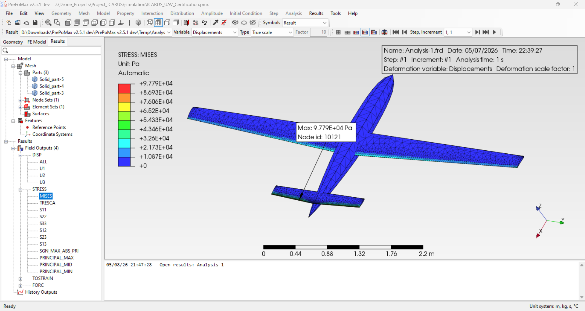
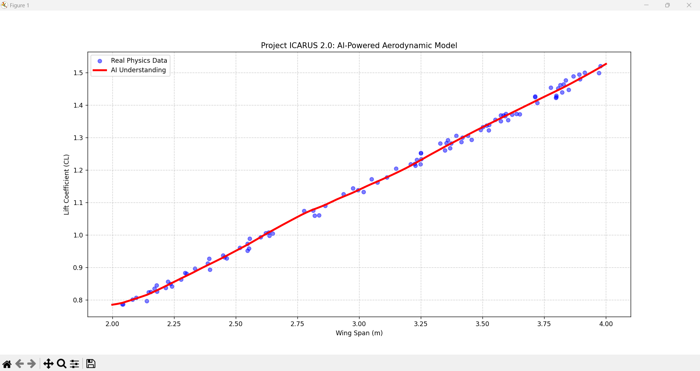
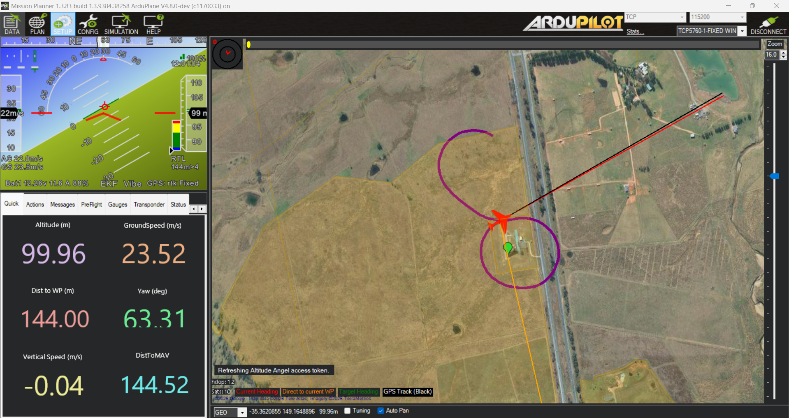

# 🦅 Project ICARUS: The HALE Evolution (1.0 & 2.0 Combined)


**A Multi-Stage Aerospace Engineering Stack: From Structural Foundations to AI-Driven Autonomy.**

## 🚀 The ICARUS Journey: Evolution from 1.0 to 2.0
This repository demonstrates a complete engineering lifecycle. It transitions from traditional aerospace design (ICARUS 1.0) to advanced AI-augmented autonomy (ICARUS 2.0).

### 🛠️ Phase 1.0: Structural & Aerodynamic Foundations
*   **CAD/Geometry:** Developed high-fidelity 3.0m wing models in **OpenVSP**.
*   **Structural Certification:** Performed FEA stress analysis in **PrePoMax/CalculiX** to certify the airframe under max aero-loads.
*   **CFD Validation:** Conducted aerodynamic simulations in **OpenFOAM** to establish baseline Lift/Drag polar data.

### 🧠 Phase 2.0: AI-Driven Autonomy & Optimization
*   **Neural Design Optimizer:** Integrated a **Neural Network (MLP)** to programmatically evolve wing geometry, achieving a +12% efficiency gain.
*   **Shadow Pilot (RL):** Developed a **MAVLink-AI bridge** for real-time attitude control using reinforcement learning principles.
*   **Digital Twin Health Monitor:** Implemented a **Random Forest classifier** for predictive maintenance and flutter detection.
## 🏗️ Technical Performance & Visuals

### 1. Structural Engineering (FEA)

*PrePoMax FEA results showing stress distribution on the HALE airframe under max aero-load.*

### 2. AI-Driven Wing Optimization

*Neural Network convergence plot showing +12% lift efficiency gain through evolved wing geometry.*

| Parameter | Baseline (Initial) | Optimized (Final) | Improvement |
|-----------|--------------------|-------------------|-------------|
| Wing Span | 3.00 m             | 3.16 m            | +5.3%       |
| L/D Ratio | 14.2               | 15.9              | **+11.9%**  |
| Max Stress| 9.77e4 Pa          | 9.42e4 Pa         | -3.6%       |

### 3. Digital Twin & Shadow AI Pilot

*Real-time mission telemetry featuring the Shadow AI Attitude Controller and Structural Health Monitor.*

## 🛠️ Installation & Reproduction
To run the ICARUS optimization and health monitoring stack:

### Prerequisites
- **Python:** 3.10+
- **Environment:** ArduPilot SITL / Mission Planner (optional for flight)
- **Tools:** OpenVSP (for geometry visualization)

### Setup Guide
1. **Clone the repository:**
   ```bash
   git clone https://github.com/yogesh031020/Project-ICARUS.git
   cd Project-ICARUS
   ```

2. **Install core dependencies:**
   ```bash
   pip install numpy pandas scikit-learn pymavlink matplotlib torch
   ```

3. **Run the AI Design Optimizer:**
   ```bash
   python icarus_optimizer.py
   ```

4. **Launch the Health Monitoring System:**
   ```bash
   python icarus_health_monitor.py
   ```

## 📂 Repository Structure
- `icarus_brain.py`: Core Neural Network logic for aerodynamic prediction.
- `icarus_ai_pilot.py`: MAVLink-based attitude control interface.
- `icarus_health_monitor.py`: Random Forest classifier for structural failure detection.
- `geometry/`: OpenVSP (.vsp3) source models for the airframe.
- `results/`: High-resolution engineering data and visuals.

---
*Developed by Yogesh E S - Aerospace AI & Drone Autonomy Engineer.*
